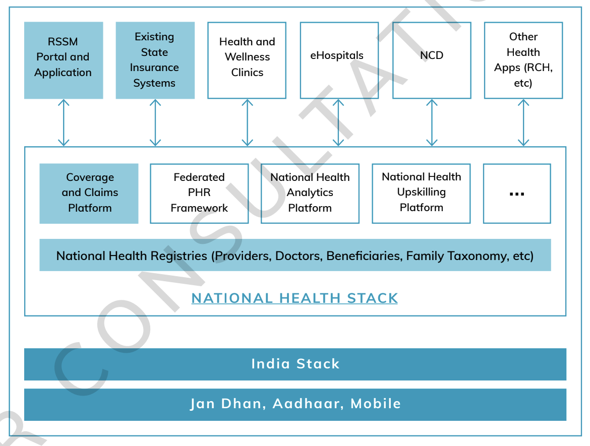
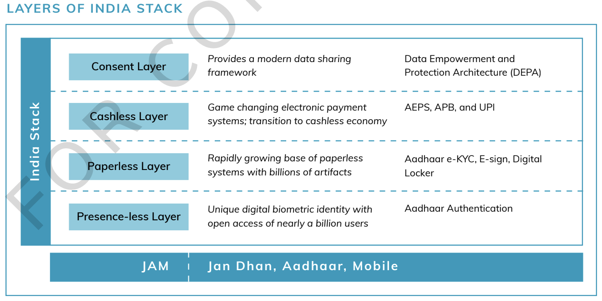
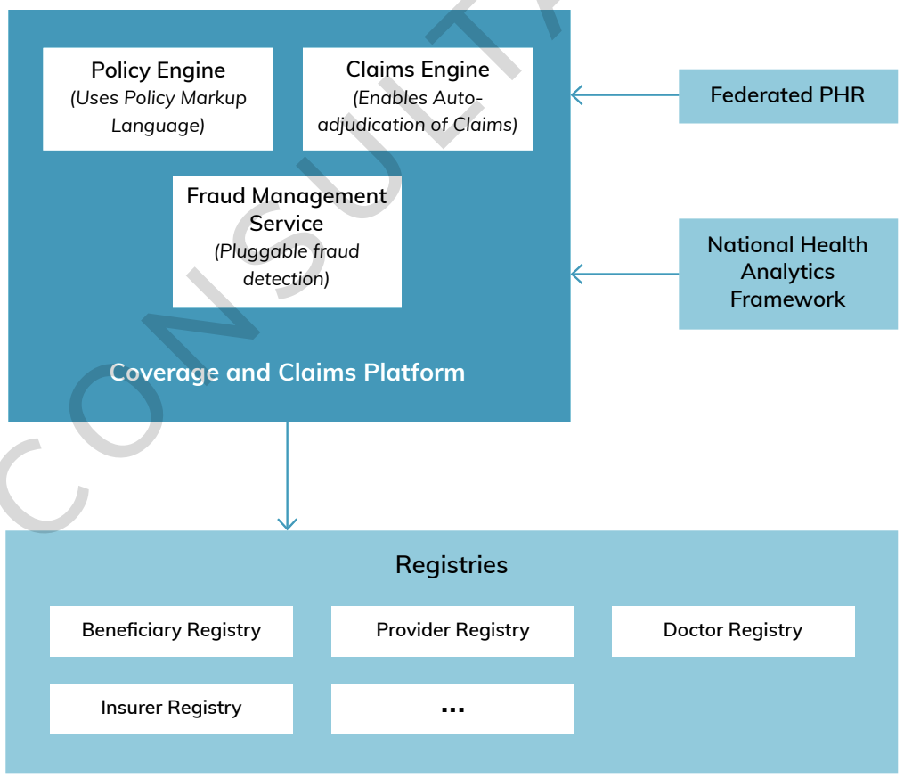
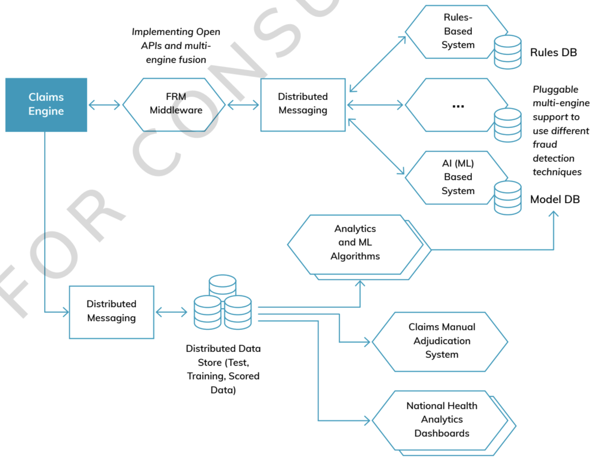
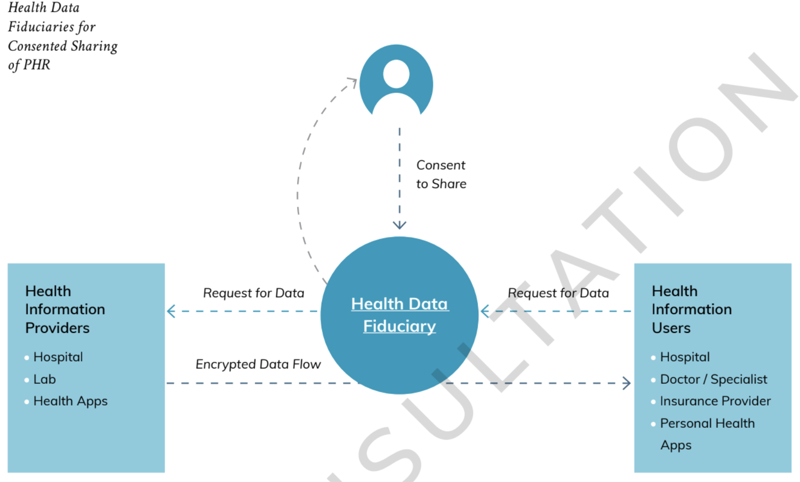

The key components of the National Health Stack are-
A. **National Health Electronic Registries**: to create a single source of truth for and manage master health data of the nation.
B. **A Coverage and Claims platform**: building blocks to support large health protection schemas, enable horizontal and 
vertical expansion of RSSM (Mantri-Rashtriya Swasthya Suraksha Mission) by states and robust fraud detection.
C. **A Federated Personal Health Records (PHR) Framework**: to solve twin challenges of access to their own health data by
patients and availability of health data for medical research, critical for advancing our understanding of human health.
D. **A National Health Analytics Platform**: to bring a holistic view combining information on multiple health initiative
and feed into smart policy making, for instance, through improved predictive analytics.
E. **Other horizontal Components**: including, and not restricted to, unique Digital Health ID, Health Data Dictionaries and
Supply Chain Management for Drugs, payment gateways etc shared across all health programs.

Objectives:
* **Continuum of Care**: as stack supports information flow across primary, secondary and tertiary healthcare.
* **Shift focus from Illness to Wellness**: to drive down future cost of health protection.
* **Cashless Care**: to ensure financial protection to the poor.
* **Timely Payments on Scientific Package Rates**: to service providers, a strong lever to participate in government-funded
healthcare programs.
* **Robust Fraud Detection**: to prevent funds leakage.
* **Improved Policy Making**: through access to timely reporting on utilization and measurement of impact across health
initiatives.
* **Enhanced Trust and Accountability**: through non-repudiable transaction audit trails.

Major Challenges in implementation:
1. **Low enrolment of entitled beneficiaries**: significant on-the-ground challenges of enrolling beneficiaries covered
under various health schemes are a result of both poor process implementation and adverse incentives. 11.3% of the bottom
40% population has any insurance coverage.
2. **Low participation by service providers**: Many hospitals and nursing homes decide not to participate or refuse to
offer services post empanelment. Main reasons cited are low package rates compared to market, long payment times and lack
of transparency in clams process. According to NSS only 4.5% of total hospitalization expenses are reimbursed to the
bottom 40%. This result in high Out-of-Pocket Expenses (OOPE).
3. **Poor fraud detection**: Lack of robust systems makes it difficult to quickly identify and prevent health insurance
fraud. This leads to funds leakage, long claim cycle time and increase in rejected claims owing to a conservative approach
adopted by insurance providers. This creates a vicious cycle of disillusioned service provider who refuses to participate
in such schemes which in turn pushes up the Out-of-Pocket Expenses (OOPE).
4. **Lack of reliable and timely data and analytics**: There are significant gaps in data availability and data quality
across the system as of now. The absence of reliable and timely data aggregated at the patient level reduces quality of
care, and at a systemic level puts significant constraints on policy makers to evaluate the performance of various palyers
or measure outcomes in a consistent manner to mark evidence-based decisions.

## The National Health Stck - High Level Architecture

* Health Stack is a nationally `shared digital infrastructure` usable by both Centre and State across public and private sectors.
NHS is a collection of `cloud-based services`, each service provides just one capability across multiple health services,
accessible via `simple open APIs` compatible with global standards. Together they create a powerful framework to bring
convergence and faster go-to market for any health initiative.
* `Scope` of NHS includes (not restricted) to the following subjects:
  - Induction of Private Hospitals and Private Practitioners into the Primary and Secondary healthcare ecosystem.
  - Focus on Non-Communicable Diseases (NCD)
  - Disease Surveillance
  - Emergency Management
  - e-Learning Platform for health
  - LMS ()
  - Telehealth
  - Tele-radiology
  - Diagnostic Equipment
  - Health Call Center(s)

### Components of the National Health Stack

At high level, components of NHS are organized in two layers:
* **National Health Registries layer**: which forms the base of Stack and houses the services required to manage the
master data for all health programs.
* **Software services and platforms**: which encapsulates additional building blocks required for operationalizing programs.
This includes a **Coverage and Claims Platform**, **Federated Personal Health Records (PHR) Framework** and a 
**National Health Analytics Framework (NHAF)** among others.

Health Stack utilizes various components of the **India Stack**
#### INDIA STACK
India Stack is a set of digital public goods which collectively make it easier for innovators to introduce digital
services in India across a range of sectors.

India Stack has 4 essential layers:
1. **Presence-less layer**, which enables removal of barriers to people's participation in formal services through digital
identities and remote authentication mechanisms.
2. **Paper-less layer**, which enables digital records to be moved with an individual's digital identity.
3. **Cashless layer**, which includes a set of payments services to ease monetary transactions.
4. **Consent layer**, which empowers individuals to share their data in a safe and secure manner, thus enabling access to
better financial, healthcare, and other services.

### ELECTRONIC REGISTRIES - MANAGING THE HEALTH MASTER DATA OF THE NATION
Everyone maintains its own copy of data that is difficult to keep updated and restricts data sharing across programs.
To overcome this challenge, NHS will incorporate a layer of electronic registries that will for the base layer of Stack.
* Registries will include data for various health-sector stakeholders:
  - healthcare providers (hospitals, clinics, labs etc), 
  - beneficiaries, 
  - doctors, 
  - insurers,
  - ASHAs,
  - information on drugs and interventions
* All registers will have open APIs for publishing and consent-based access by authorised entities.

#### Principles of well-designed registries
The registries in NHS will be developed with following design principles in mind:
**Self-Maintainability**: Entities listed in the registry should be able to view their information and through appropriate
workflows be able to update their information in a verifiable and trusted manner.
**Non-Repudiable Data**: The source for each attribute in the registry should be visible: viewers should be able to tell
who added which information and when. All attributes should be digitally signed by the authorized updater. This leads to
greater trust in the data and stronger accountability.
**Incentive-aligned Design**: Registry owners must attempt to enact mandates that require the entities listed by the 
registry, to register and to keep their data up to date. Where mandates are not possible, suitable incentives need to be
provided as part of the implementation process. Ex, empanelment of hospitals for health insurance must encourage the
insurer or third-party administrator (TPA) to always obtain the information from the provider registry and not collect it
directly from the provider. This ensures that the provider has an incentive to keep its registry entry up to date.
**Extensibility and Flexible Schemas**: Registry owners will have to set up a process to accept feedback and to update
registry schemas. Health applications built on top of the Health Stack should be able to extend the base registries and 
use derived versions of them.
**Open APIs**: Creation, updating and retrieval of data must be possible using open APIs. For some APIs, entity authentication
mechanisms must be implemented in order to ensure data security.
**Controlled Data Visibility and Consented Data Sharing**: Registries will offer fine-grained control and visibility over
each attribute of an entity. Attributes can be `public or private, masked or encrypted`. Sharing of private attributes
to a data requestor will require consented access.
**Data Provenance**: A non-repudiable audit trail must exist for all changes made to entries in the registry. In general,
it should not be possible to delete data from registries, through it may be possible for the registry owner to mark certain
entries as obsolete.

#### Approach and Considerations for designing Electronic Registries
Few essential elements of the approach taken to design two important registries:
**Provider Registry**: This will be the one which will manage master data for all healthcare providers in the country.
This will include hospitals (both government and private), clinics, diagnostic labs and other clinical establishments.
  Multiple efforts are currently underway to build provider registries in india:
* **National Health Resource Repository (NHRR) managed by Central Bureau of Health Intelligence (CBHI)**,
* **NIN database implemented by Ministry of Health and Family Welfare (MoHFW)**,
* **NIC and the Registry of Hospitals in Network of Insurance (ROHINI) developed by the Insurance Information Bureau of India (IIB)**
  All existing registry implementations will be able to publish provider information securely to the NHS registry, on a
per-provider basis or in bulk, and extract information from it for their respective programs. Also flexible enough to
extend provider schemas defined in the NHS registry for individual use cases.
**Beneficiary Registry**: Health programs are likely to use a variety of identifiers to identify individual and family on
the ground, and so the beneficiary registry in the NHS should be designed to offer flexibility. The base entry in the
beneficiary registry will be created with a link to a strong foundational ID such as beneficiary's Aadhaar number. The
registry would allow any number of other identifiers being used in the health system to be linked to Health ID. This will
not only enable a holistic view of different programs that beneficiaries participate in, it will also enable efficient
search and recovery of beneficiary details given program-specific identifiers.
  Beneficiary-to-beneficiary linkages e.g, information about a beneficiary's family will be available from the record
corresponding to that beneficiary. NHS registry will not assign any group IDs (family IDs) to beneficiaries although such
attributes may be added by individual NHS applications.
    

### COVERAGE AND CLAIMS PLATFORM
The coverage and claims platform provides the building blocks required to implement any large-scale health insurance
program, in particular, any government-funded healthcare programs. This platform has the transformative vision of enabling
both public and private actors to implement insurance schemes in an automated, data-driven manner through open APIs.
  There will be three primary sub-components of this platform: **a policy engine**, **a claims engine**, 
and **a fraud management service**.

Coverage and Claims Platform and linkages with the National Health Stack

#### Policy Engine
The Policy Engine is a service that allows defining and storing of insurance policies for individuals and families in a
machine-readable format, and provides APIs to consume and update these policies. Two key components of this engine are
**Unified Multi-Policy View** per beneficiary and a new **Policy Markup Language (PML)**.
- **Unified Multi-Policy View**: Policy Engine, through its APIs, will empower beneficiaries to get a unified view of all
their health insurance policies in a convenient and user-friendly manner. This will cover both government-funded healthcare
plicies as well as private insurance policies that the beneficiary may have purchased.
- **Policy Markup Language (PML)**: a machine-readable language designed for describing, updating, accessing and 
communicating policies between software programs. The PML will enable health insurance policies to be written to cover
their various attributes, including:
  * The list of empaneled providers liked to the policy,
  * The coverage amount
  * The coverage period
  * List of procedures that are covered
  * Pre-authorization requirements for procedures
  * Pre-authorization approver details
  * Hospitalization costs payable for each procedure
  * Exclusion criteria for any procedures

These policy is uploaded and validated to be syntactically correct in the policy repository.
Each policy will need to be accompanied with a digital signature and linked to the entity that is providing the coverage
(eg, insurance company or health trust set up by the state).
Only when the signature has been generated will the policy become active. The Policy Engine will allow policies to be
activated at different times for each beneficiary.
Activation requires that premiums that cover the beneficiary be transferred to the insurance company or health trust.

Subject to the approval and successful demonstration of the technology, there could
be a possibility for policies to be developed based on Smart Contracts, a derivative
of Blockchain Technology. Smart contracts will enable policies to have intelligence
embedded in them, which will allow each policy to directly interact with the Claims
Engine (or other parts of the Stack). So, for example, policies would automatically be
able to trigger insurance payments once certain conditions in the claims process are
met.

#### Claims Engine
Claims Engine will manage the way claims flow in health insurance schemes and ensure ease of filing and settling claims.
This engine will:
1. **Ensure auth-adjudication of claims**: A large part of the claims process (covering both pre-suthorization and 
post-treatment claims processing) can be automated given machine-readable description of policies, as in the Policy
Markup Language. Claims engine will accomplish this automation, which in turn will help insurers and 
**third-party administrators (TPAs)** in making faster decisions.
2. **Orchestrate the payment flow**: Claims engine will send payment triggers and notifications to designated entities
which will help ensure that insurance **Service Level Agreements (SLAs)** are adhered to and claims processing times
are accurately reported to the authorities.
3. **Provide data points**: Claims engine will generate a rich data trail on the history of claims processed by NHS,
which will serve as the key input to the `Fraud Management Service (FMS)`.
4. **Receive requests for audit**: The claims engine may also receive requests for audit on past claims from the **FMS**
In such situations, claims would be reassessed and the resulting analyses provided back to the FMS. With better data,
suspicious claims can be detected and analysed in this manner.

- Claims in coverage and claims platform are settled within the time defined by the SLA fo the insurance policy.
- The engine is responsible for ensuring the claims originating in the system are adjudicated at the earliest when external
Fraud Management System (FMS) recommends an action to be taken on the claim.
- FMS may recommend acceptance or advice TPA intervention for a newly filed and documented claim. If FMS recommends
acceptance, the platform will auto-adjudicate the claim in accordance with rules specified in the policy.

.png)

#### Fraud Management Service
* Fraud management component is responsible for ensuring that the number of fraudulent claims settled by coverage and 
claims platform is minimized.
* Fraud management service will implemented leveraging multiple engines in an effort to encourage innovation. 
In order to maximize fraud detection rates and accuracy, the engines will be incentivized to report fraud events and 
will compete with each other in the process.
* Data feed into the fraud management system wil be anonymized to protect patient and provider privacy.

> When a fraud is reported, all pending claim settlements and any new claim settlements for a hospital are placed on
hold until the fraud raised can be investigated.
* Governments, insurance companies and third-party administrator (TPAs) are expected to have vigilance teams that
investigate the fraud scenarios suggested by the fraud management service.
* The teams would need to decide as to whether it is a truly fraudulent scenario or an item incorrectly flagged as fraud.
The FMS service gets the feedback from the same process.
> Note: As most claim fails not because of fraud but either unwanted/redundant test and procedures, or claims made by
patients/providers on false procedures.

### DIGITAL HEALTH ID
* NHS will provide for a mechanism through which every user participating in the system can be uniquely identified.
* Accurate identification will greatly reduce the risk of preventable medical errors and significantly increase quality
of care.
* Upon successful registration of the user, `Digital Health ID (unique, system-wide identifier)` will be created and
provided to the registrant. 
* Registrant may create a Virtual Health ID to preserve their privacy when interacting with other users or stakeholders
in the system.
* When enrolling into any Scheme, users will be able to provide one of many national identifiers (Aadhaar, PAN card,
Election ID etc) to identify themselves as specified by `National Health Policy`. Upon successfully completing KYC, 
users will be registered by the system. The NHS Health ID is generated for each user upon successful registration in 
the system.
> Health ID may also be looked up in a secure manner if beneficiary does not have her identifier handy. 
Ex: a beneficiary visiting a provider, in the absence of NHS Health ID, may authenticate against Aadhaar. A secure
verification process will ensure that beneficiary is validated. The provider will then be able to look up this
beneficiary's relevant information using this `reverse lookup`.

### FEDERATED PERSONAL HEALTH RECORDS (PHR) FRAMEWORK
* Health Stack enables management and aggregation of user health data, as well as consent-based flow of such data
across different stakeholders who require access in order to deliver value-added services to the user.
> Personal Health Records (PHR) refers to the integrated view of all data related to an individual across various
> health providers. Comprise 1. medical history, 2. medication and allergies, 3. immunization status, 4. 
> laboratory test results 5. radiology images, 6. vital signs, 7. personal stats (age and weight, demographics and
> billing information) 8. multiple health apps.
* PHR is maintained in a secure and private environment, with the individual determining rights of access.
* **Health Data Fiduciaries (trustees)** shall facilitate consent-driven interaction between entities that generate
the health data and entities that want to consume the PHR for delivering better services to the individual.

Key guiding principles for this framework are:
1. **The Patient is the Controller of her data**: True empowerment occurs when the patient is the controller of data
rather than just the owner.
2. **Leveraging a Federated, rather than a Centralized Approach**: Enables meaningful health data to be stored and 
managed in a `federated` manner (e.g., hospital systems, health-technology companies etc). User will be able to share
their data via Health Data Fiduciaries with data request. This will be achieved using standardized and open APIs
through which these entities will be able to communicate with each other and with stakeholder systems. Such an approach
to managing and sharing data has many advantages from a scalability and flexibility perspective over a centralized
solution for managing health data.
3. **Privacy by Design**: User data needs to be protected from abuse and compromise. `PHR framework will define data
sharing mechanisms, using MeitY Electronic Consent Framework`, that gives the user control of their data and ensures
privacy of user data ground-up.
4. **Minimal changes to existing health record formats**: Diverse IT products used by healthcare providers in India do
not follow a common standard for data storage and don't communicate with each other. Therefore the framework must require
minimal to no change to existing IT products and must be designed to work with the exiting IT infrastructure as-is.
5. **A clear incentive for providers to participate**: Almost 80% of Indians seek private healthcare and pay out of pocket.
In order to ensure private healthcare providers participate, framework should support built-in incentive structures to
ensure rapid and universal adoption. `Incentive and regulatory control need to be suitable balanced, in order to ensure
maximum participation and innovation, and still ensuring user privacy and control`.
6. **Open APIs**: Framework should provide `open and standard set of application programming interfaces (APIs)` for
creating, accessing and updating records in EHRs, as proposed in the Policy for Open APIs by MeitY. API definitions
should be simple and follow the principles of minimalism and privacy by design.

### NATIONAL HEALTH ANALYTICS FRAMEWORK
* This enables creation of anonymised and aggregated datasets that assist in creation of dashboards, reports, and other
types of statistics. In alignment with **National Data Sharing and Accessibility Policy (NDSAP)**, open datasets shall
be published as part of this framework to increase transparency, accountability, civil society engagement, and
innovations in service delivery.
* Few examples of data which could be obtained through this framework are listed below:
  - Average number of patients treated in a day
  - Most commonly occurring diseases in India (Epidemiology)
  - Percentage of claims filed by entities (Healthcare Provider, or Beneficiaries) that are accepted/rejected (Resource Utilisation)
  - Average billed amount / billed amount for a particular medical procedure
  - Average time of settlement
  - Treatment characteristics and procedures
  - Years of experience of doctors across state/district/country
* Treatment and patient care data in `PM-RSSM` can provide critical insights into healthcare skill shortage at
various governance levels and enable the implementation of skill development initiatives at a very granular level (
for instance, through ASHA workers).
* National Health Analytics Framework will also develop newly benchmarked standards in areas such as `data formats,
pricing, standard operating procedures in daily operations, and standard treatment procedures with optiomal cost` - whilst
also providing opportunity for continuous evaluation of National Health Policy.
* Also help shifting evaluation away from an annual exercise towards a real-time approach, to help rapidly curate data
collected through the insurance schemes and feed into agile smart policy decisions.

## Guiding Principles for the Overall Design of National Health Stack
* Mandated PHR: Every citizen has a right to not just her/his health data but also right to access to structured data.
* Separating the Consent Layer from Data Flow is Key
* Interoperability through Open APIs and Open Standards
* Privacy and Security by Design
* Strong Data Governance
* Ensuring Extensibility through the use of Layered Design
* Granular Control
* Designing for Evolvability and Scale
* Based on Common Open-Source to create Public Goods
* Transparency and Accountability through Data

## Benefits of the National Health Stack
There are numerous benefits for central and state governments, private sector, nudge healthcare service and insurance
providers towards efficiency and accountability. These are outlined below:

### BENEFITS TO PUBLIC
Help to shift policy making to Citizen and Wellness Centric. As NHS matures with data over time, it will be well
equipped to deliver solutions (in phases) to the four big challenges of healthcare faced by the people of India - 
**availability, accessibility, affordability and acceptability**.

#### Phase 1 - Improving Affordability
Increased participation of service providers and availability of healthcare services due to **justified pricing, 
instant adjudication and On Time payment of claims** will result in more widespread cashless care.
#### Phase 2 - Improving Accessibility and Availability
* Allow beneficiaries to avail the policy at any point in time of the year
* Increase access and availability of service providers for beneficiaries through the `Faster Adjudication of claims feature`
for service providers, making program more attractive to them.
* Incentivize service providers to set up facilities closer to the beneficiaries (e.g., tier 3 towns) - thus empowering
the beneficiaries with choice.
#### Phase 3 - Improve Acceptability
* **Value-based Purchasing** feature can now be introduced as the Stack collates enough data to initiate a reward-based
program based on incentivized payments and public reporting for the quality of care they give to patients, productivity
and cost control.
* Hospital Value-based Purchasing Program encourage hospitals to improve the quality and safety of acute inpatient care
for health protection beneficiaries and all patients by:
  - Eliminating or reducing adverse events (healthcare errors resulting in patient harm)

  

